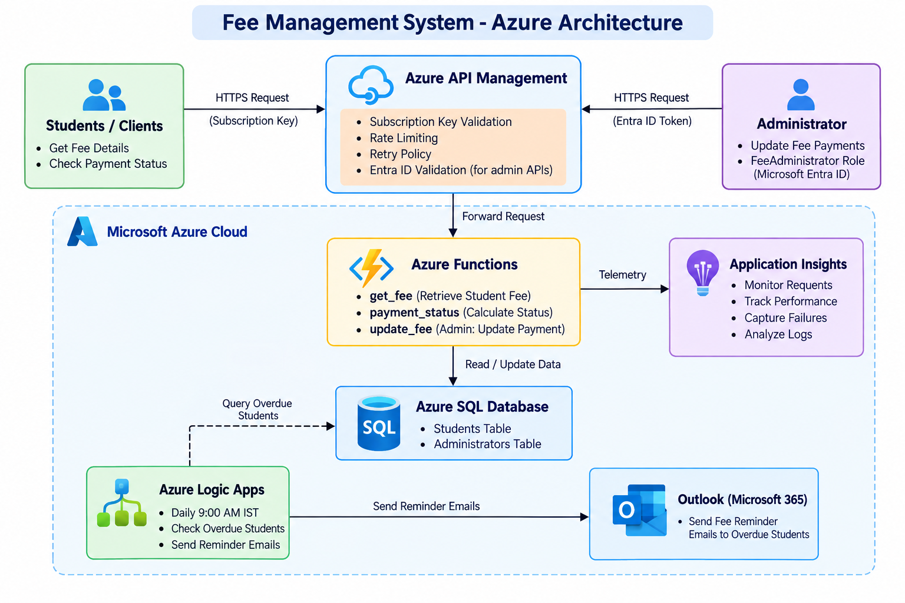

# Fee Management System Using Azure

This project is a cloud-based fee management solution built using Microsoft Azure. It allows institutions to store student fee records, retrieve fee details, calculate payment status, update payments securely, and send overdue reminders through automated workflows.

## Overview

The system is designed to:
- Manage student and fee information in Azure SQL Database
- Expose secure APIs using Azure Functions
- Protect admin operations with Azure API Management and Microsoft Entra ID
- Send overdue fee reminders using Azure Logic Apps and Outlook
- Monitor application activity using Application Insights

## 1. Code and Configuration

The repository contains the main source code, database scripts, API policies, and Logic App workflow configuration used in the solution.

- Azure Functions:
  - azure-functions/db.py
  - azure-functions/function_app.py
  - azure-functions/host.json
  - azure-functions/requirements.txt

- Database scripts:
  - database/create_tables.sql
  - database/sample_data.sql
  - database/generate_5000_students.sql

- API Management policies:
  - apim-policy.xml
  - apim-update-fee-policy.xml
  - update-fee-policy.xml

- Logic App:
  - logic_app/workflow-definition.json

- Token generation utility:
  - get_token.py

Sensitive local configuration files such as `local.settings.json` and generated access tokens are excluded from GitHub using `.gitignore`.

## 2. Solution Architecture

The following diagram shows the overall architecture of the Fee Management System:

### Azure Services

- **Azure SQL Database** — stores student fee and administrator records.
- **Azure Functions** — provides fee retrieval, payment status, and administrator fee update APIs.
- **Azure API Management** — exposes and secures APIs using subscription keys, rate limiting, and retry policies.
- **Microsoft Entra ID** — authenticates administrators and validates the `FeeAdministrator` role.
- **Azure Logic Apps** — automatically identifies overdue fees and sends reminder emails.
- **Outlook** — sends fee reminder notifications.
- **Application Insights** — monitors Function App activity and performance.

## 3. Deployment Guide

### Step 1: Create Azure SQL Database
1. Create a new Azure SQL Database in the Azure portal.
2. Create the required tables by running the SQL script in database/create_tables.sql.
3. Insert the 20 sample student records and administrator records using database/sample_data.sql.

### Step 2: Configure the Function App
1. Create an Azure Function App using Python runtime.
2. Configure application settings:
   - AzureWebJobsStorage
   - FUNCTIONS_WORKER_RUNTIME
   - SQL_CONNECTION_STRING
3. Deploy the project files inside azure-functions.
4. Install the required Python packages from azure-functions/requirements.txt.

### Step 3: Configure API Management
1. Create an Azure API Management instance.
2. Import the Azure Functions endpoints into APIM.
3. Apply the API Management policy files.
4. Set the backend URL to the deployed Azure Function endpoints.
5. Require APIM subscription keys for the student-facing APIs.
6. Apply rate limiting to control API usage.
7. Apply retry handling for temporary backend failures.

### Step 4: Secure Admin Updates with Entra ID
1. Register the administrator API application in Microsoft Entra ID.
2. Configure the `FeeAdministrator` application role.
3. Assign the role to the authorized administrator.
4. Validate the administrator's Entra ID access token in the APIM policy.
5. Use get_token.py to generate an access token for testing admin requests.

### Step 5: Configure Logic App for Reminders
1. Create a Logic App in Azure.
2. Configure a daily recurrence trigger at 9:00 AM IST.
3. Query Azure SQL for students with overdue payments.
4. Send reminder emails through the Outlook connector.
5. Configure exponential retry policies for the SQL and Outlook actions.
6. Verify successful executions using Logic App run history.

### Step 6: Test the Solution
1. Test student fee lookup through the APIM endpoint.
2. Verify that requests without an APIM subscription key are rejected.
3. Test payment status calculation for Paid, Partially Paid, and Overdue records.
4. Test admin fee updates using a valid Entra ID administrator token.
5. Verify unauthorized admin requests are rejected.
6. Check the database after successful updates.
7. Verify overdue reminder emails are sent by the Logic App.
8. Monitor Function App activity using Application Insights.
9. Use the scalability test script to generate 5,000 test student records in a test database.

## 4. Scalability and Monitoring

- Azure SQL uses `StudentID` as the primary key for efficient student record lookup.
- A scalability test script is provided in `database/generate_5000_students.sql` to generate 5,000 unique test student records.
- The scalability script should be executed in a separate test database to avoid affecting the demonstration data.
- Azure Functions are deployed as a serverless API layer that can scale with incoming requests.
- Application Insights is connected to the Function App for monitoring requests, response times, and failures.
- Logic App run history is used to monitor reminder workflow executions.

## 5. Security Notes

- Do not upload real credentials, API keys, or access tokens to GitHub.
- Keep `local.settings.json` and generated access tokens local and excluded through `.gitignore`.
- Store SQL connection strings and other secrets in Azure App Settings or Azure Key Vault.
- Use APIM subscription keys for student-facing API access.
- Use Microsoft Entra ID and the `FeeAdministrator` role to protect admin fee updates.
- Apply APIM rate limiting and retry policies for improved API reliability.
- Restrict fee update operations to authorized administrators only.

## 6. Summary

The Fee Management System is a cloud-native Azure solution for managing student fee records and automating overdue payment reminders.

The solution combines:

- Azure SQL Database for structured fee data
- Azure Functions for serverless API operations
- Azure API Management for secure API exposure, subscription keys, rate limiting, and retry handling
- Microsoft Entra ID and RBAC for secure administrator operations
- Azure Logic Apps and Outlook for automated overdue fee reminders
- Application Insights for monitoring
- A scalability test script for 5,000 student records

The system provides separate read and administrative operations while protecting sensitive fee updates through role-based administrator access.